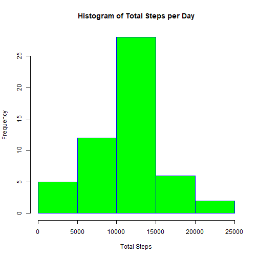
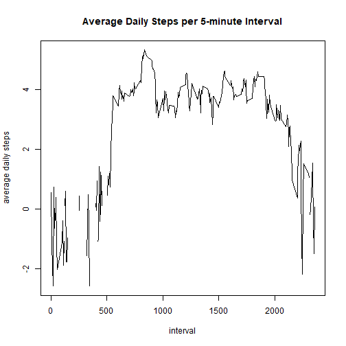
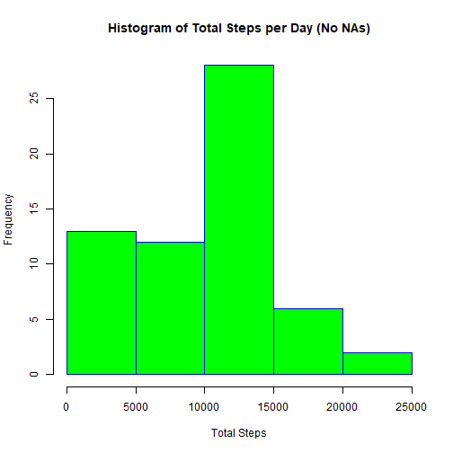
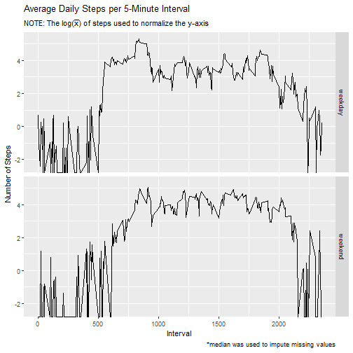

## Loading and preprocessing the data  

```r
# Load all necessary packages for this project
x<-c("collapse", "Hmisc", "ggplot2")
suppressMessages(suppressWarnings(
lapply(x, require, character.only = TRUE, quietly = TRUE)
))
```


```r
# Create a temporary file to store the downloaded zip file
fileUrl <- "https://d396qusza40orc.cloudfront.net/repdata%2Fdata%2Factivity.zip"
temp <- tempfile()
download.file(fileUrl, temp)

# Get a list of the files in the zip file
zipFiles <- unzip(zipfile = temp, list = TRUE)

# Read in 'activity.csv' from the zip file using its index in zipFiles
targetData <- read.csv(unz(temp, zipFiles$Name[1]), header = TRUE)

# Convert date variable to date data type
targetData$date <- as.Date(targetData$date)

# Review data characteristics
str(targetData)
```

```
## 'data.frame':	17568 obs. of  3 variables:
##  $ steps   : int  NA NA NA NA NA NA NA NA NA NA ...
##  $ date    : Date, format: "2012-10-01" "2012-10-01" "2012-10-01" ...
##  $ interval: int  0 5 10 15 20 25 30 35 40 45 ...
```

```r
summary(targetData)
```

```
##      steps             date               interval     
##  Min.   :  0.00   Min.   :2012-10-01   Min.   :   0.0  
##  1st Qu.:  0.00   1st Qu.:2012-10-16   1st Qu.: 588.8  
##  Median :  0.00   Median :2012-10-31   Median :1177.5  
##  Mean   : 37.38   Mean   :2012-10-31   Mean   :1177.5  
##  3rd Qu.: 12.00   3rd Qu.:2012-11-15   3rd Qu.:1766.2  
##  Max.   :806.00   Max.   :2012-11-30   Max.   :2355.0  
##  NA's   :2304
```

## What is mean total number of steps taken per day?
For this part of the assignment, you can ignore the missing values in the dataset.

1. Calculate the total number of steps taken per day.

```r
# Calculate the total number of steps taken per day
dailySteps.sum <- setNames(
        aggregate(x = targetData$steps, by = list(targetData$date), FUN = sum),
        c("date", "total_steps"))

# Review data characteristics
str(dailySteps.sum)
```

```
## 'data.frame':	61 obs. of  2 variables:
##  $ date       : Date, format: "2012-10-01" "2012-10-02" "2012-10-03" ...
##  $ total_steps: int  NA 126 11352 12116 13294 15420 11015 NA 12811 9900 ...
```

```r
summary(dailySteps.sum)
```

```
##       date             total_steps   
##  Min.   :2012-10-01   Min.   :   41  
##  1st Qu.:2012-10-16   1st Qu.: 8841  
##  Median :2012-10-31   Median :10765  
##  Mean   :2012-10-31   Mean   :10766  
##  3rd Qu.:2012-11-15   3rd Qu.:13294  
##  Max.   :2012-11-30   Max.   :21194  
##                       NA's   :8
```

2. Make a histogram of the total number of steps taken each day.

```r
# Make a histogram of the total number of steps taken each day
hist(dailySteps.sum$total_steps,
     main = "Histogram of Total Steps per Day",
     xlab = "Total Steps",
     border = "blue", 
     col = "green")
```



3. Calculate and report the mean and median of the total number of steps taken
per day.


```r
# Calculate and report the mean and median of the total number of steps taken
# per day.

# Aggregate mean and median steps by date simultaneously
aggSteps <- setNames(
        collap(targetData, steps ~ date, 
               custom = list(fmean = "steps", fmedian = "steps"), 
               give.names = FALSE), 
        c("mean.steps", "median.steps", "date")
)
aggSteps[ , c(3, 1, 2)]
```

```
##          date mean.steps median.steps
## 1  2012-10-01         NA           NA
## 2  2012-10-02  0.4375000            0
## 3  2012-10-03 39.4166667            0
## 4  2012-10-04 42.0694444            0
## 5  2012-10-05 46.1597222            0
## 6  2012-10-06 53.5416667            0
## 7  2012-10-07 38.2465278            0
## 8  2012-10-08         NA           NA
## 9  2012-10-09 44.4826389            0
## 10 2012-10-10 34.3750000            0
## 11 2012-10-11 35.7777778            0
## 12 2012-10-12 60.3541667            0
## 13 2012-10-13 43.1458333            0
## 14 2012-10-14 52.4236111            0
## 15 2012-10-15 35.2048611            0
## 16 2012-10-16 52.3750000            0
## 17 2012-10-17 46.7083333            0
## 18 2012-10-18 34.9166667            0
## 19 2012-10-19 41.0729167            0
## 20 2012-10-20 36.0937500            0
## 21 2012-10-21 30.6284722            0
## 22 2012-10-22 46.7361111            0
## 23 2012-10-23 30.9652778            0
## 24 2012-10-24 29.0104167            0
## 25 2012-10-25  8.6527778            0
## 26 2012-10-26 23.5347222            0
## 27 2012-10-27 35.1354167            0
## 28 2012-10-28 39.7847222            0
## 29 2012-10-29 17.4236111            0
## 30 2012-10-30 34.0937500            0
## 31 2012-10-31 53.5208333            0
## 32 2012-11-01         NA           NA
## 33 2012-11-02 36.8055556            0
## 34 2012-11-03 36.7048611            0
## 35 2012-11-04         NA           NA
## 36 2012-11-05 36.2465278            0
## 37 2012-11-06 28.9375000            0
## 38 2012-11-07 44.7326389            0
## 39 2012-11-08 11.1770833            0
## 40 2012-11-09         NA           NA
## 41 2012-11-10         NA           NA
## 42 2012-11-11 43.7777778            0
## 43 2012-11-12 37.3784722            0
## 44 2012-11-13 25.4722222            0
## 45 2012-11-14         NA           NA
## 46 2012-11-15  0.1423611            0
## 47 2012-11-16 18.8923611            0
## 48 2012-11-17 49.7881944            0
## 49 2012-11-18 52.4652778            0
## 50 2012-11-19 30.6979167            0
## 51 2012-11-20 15.5277778            0
## 52 2012-11-21 44.3993056            0
## 53 2012-11-22 70.9270833            0
## 54 2012-11-23 73.5902778            0
## 55 2012-11-24 50.2708333            0
## 56 2012-11-25 41.0902778            0
## 57 2012-11-26 38.7569444            0
## 58 2012-11-27 47.3819444            0
## 59 2012-11-28 35.3576389            0
## 60 2012-11-29 24.4687500            0
## 61 2012-11-30         NA           NA
```

## What is the average daily activity pattern?
Make a time series plot (i.e. <font color = "red"> type = "l"</font>) of the 5-minute interval (x-axis) and the average number of steps taken, averaged across all days (y-axis).  

```r
# Calculate average (i.e., mean) daily steps per 5-minute interval
aggInterval <- setNames(
        collap(targetData, steps ~ interval, 
               custom = list(fmean = "steps"), 
               give.names = FALSE), 
        c("mean.steps", "interval")
)

# Plot the average daily steps per 5-minute interval
with(aggInterval, plot(interval, log(mean.steps), type = "l",
                       main = "Average Daily Steps per 5-minute Interval",
                       ylab = "average daily steps")
)  
```



Which 5-minute interval, on average across all the days in the dataset, contains the maximum number of steps? 835

```r
# Determine 5-minute interval with maximum number of steps across all days
aggInterval[aggInterval$mean.steps == max(aggInterval$mean.steps),]
```

```
##     mean.steps interval
## 104   206.1698      835
```

## Imputing missing values
Note that there are a number of days/intervals where there are missing values (coded as <font color = "red">NA</font>). The presence of missing days may introduce bias into some calculations or summaries of the data.  

Calculate and report the total number of missing values in the dataset (i.e. the total number of rows with <font color = "red">NAs</font>): 2304  

```r
# Calculate total number of rows with NA values
sum(!complete.cases(targetData))
```

```
## [1] 2304
```

```r
# Alternative method of calculating individual rows with NA values
sapply(targetData, function(x) sum(is.na(x)))
```

```
##    steps     date interval 
##     2304        0        0
```

Devise a strategy for filling in all of the missing values in the dataset. The strategy does not need to be sophisticated. For example, you could use the mean/median for that day, or the mean for that 5-minute interval, etc.
Create a new dataset that is equal to the original dataset but with the missing data filled in.  

```r
# Duplicate original data set
targetData_NoNA <- targetData

# Impute NA values in new data set using the median
targetData_NoNA$steps <- with(targetData_NoNA, impute(steps, median))
summary(targetData_NoNA)
```

```
## 
##  2304 values imputed to 0
```

```
##      steps             date               interval     
##  Min.   :  0.00   Min.   :2012-10-01   Min.   :   0.0  
##  1st Qu.:  0.00   1st Qu.:2012-10-16   1st Qu.: 588.8  
##  Median :  0.00   Median :2012-10-31   Median :1177.5  
##  Mean   : 32.48   Mean   :2012-10-31   Mean   :1177.5  
##  3rd Qu.:  0.00   3rd Qu.:2012-11-15   3rd Qu.:1766.2  
##  Max.   :806.00   Max.   :2012-11-30   Max.   :2355.0
```
Make a histogram of the total number of steps taken each day.  

```r
# Calculate the total number of steps taken per day
dailySteps.sum_v2 <- setNames(
        aggregate(x = targetData_NoNA$steps, by = list(targetData_NoNA$date), FUN = sum),
        c("date", "total_steps"))
# Make a histogram of the total number of steps taken each day
hist(dailySteps.sum_v2$total_steps,
     main = "Histogram of Total Steps per Day (No NAs)",
     xlab = "Total Steps",
     border = "blue", 
     col = "green")
```



Calculate and report the **mean** and **median** total number of steps taken per day.  

```r
# Calculate and report the mean and median of the total number of steps taken
# per day.

# Aggregate mean and median steps by date simultaneously
aggSteps_v2 <- setNames(
        collap(targetData_NoNA, steps ~ date, 
               custom = list(fmean = "steps", fmedian = "steps"), 
               give.names = FALSE), 
        c("mean.steps", "median.steps", "date")
)
aggSteps_v2[ , c(3, 1, 2)]
```

```
##          date mean.steps median.steps
## 1  2012-10-01  0.0000000            0
## 2  2012-10-02  0.4375000            0
## 3  2012-10-03 39.4166667            0
## 4  2012-10-04 42.0694444            0
## 5  2012-10-05 46.1597222            0
## 6  2012-10-06 53.5416667            0
## 7  2012-10-07 38.2465278            0
## 8  2012-10-08  0.0000000            0
## 9  2012-10-09 44.4826389            0
## 10 2012-10-10 34.3750000            0
## 11 2012-10-11 35.7777778            0
## 12 2012-10-12 60.3541667            0
## 13 2012-10-13 43.1458333            0
## 14 2012-10-14 52.4236111            0
## 15 2012-10-15 35.2048611            0
## 16 2012-10-16 52.3750000            0
## 17 2012-10-17 46.7083333            0
## 18 2012-10-18 34.9166667            0
## 19 2012-10-19 41.0729167            0
## 20 2012-10-20 36.0937500            0
## 21 2012-10-21 30.6284722            0
## 22 2012-10-22 46.7361111            0
## 23 2012-10-23 30.9652778            0
## 24 2012-10-24 29.0104167            0
## 25 2012-10-25  8.6527778            0
## 26 2012-10-26 23.5347222            0
## 27 2012-10-27 35.1354167            0
## 28 2012-10-28 39.7847222            0
## 29 2012-10-29 17.4236111            0
## 30 2012-10-30 34.0937500            0
## 31 2012-10-31 53.5208333            0
## 32 2012-11-01  0.0000000            0
## 33 2012-11-02 36.8055556            0
## 34 2012-11-03 36.7048611            0
## 35 2012-11-04  0.0000000            0
## 36 2012-11-05 36.2465278            0
## 37 2012-11-06 28.9375000            0
## 38 2012-11-07 44.7326389            0
## 39 2012-11-08 11.1770833            0
## 40 2012-11-09  0.0000000            0
## 41 2012-11-10  0.0000000            0
## 42 2012-11-11 43.7777778            0
## 43 2012-11-12 37.3784722            0
## 44 2012-11-13 25.4722222            0
## 45 2012-11-14  0.0000000            0
## 46 2012-11-15  0.1423611            0
## 47 2012-11-16 18.8923611            0
## 48 2012-11-17 49.7881944            0
## 49 2012-11-18 52.4652778            0
## 50 2012-11-19 30.6979167            0
## 51 2012-11-20 15.5277778            0
## 52 2012-11-21 44.3993056            0
## 53 2012-11-22 70.9270833            0
## 54 2012-11-23 73.5902778            0
## 55 2012-11-24 50.2708333            0
## 56 2012-11-25 41.0902778            0
## 57 2012-11-26 38.7569444            0
## 58 2012-11-27 47.3819444            0
## 59 2012-11-28 35.3576389            0
## 60 2012-11-29 24.4687500            0
## 61 2012-11-30  0.0000000            0
```
Do these values differ from the estimates from the first part of the assignment?  
<font color = "blue">Yes, these values differ.</font>  
What is the impact of imputing missing data on the estimates of the total daily number of steps?  
<font color = "blue">Imputing the data has a tendency to change the statistical characteristics of the data set (e.g., change the mean and quantile breakpoints).  

More importantly, the null values resulted from full days without activity recorded rather than sporadic null values throughout a day at various 5-minute intervals; therefore, it would have been more prudent to simply eliminate the incomplete cases instead of imputing values into previously unrecorded days.</font>  

## Are there differences in activity patterns between weekdays and weekends?
For this part the <font color = "red">weekdays()</font> function may be of some help here. Use the dataset with the filled-in missing values for this part.

Create a new factor variable in the dataset with two levels – “weekday” and “weekend” indicating whether a given date is a weekday or weekend day.  

```r
# Add new variable to data set without nulls
targetData_NoNA$day.type <- weekdays(targetData_NoNA$date)

# Identify weekends and update day.type variable
targetData_NoNA$day.type[targetData_NoNA$day.type %in% c("Saturday", "Sunday")] <- "weekend"

# Identify weekdays and update day.type variable
targetData_NoNA$day.type[targetData_NoNA$day.type != "weekend"] <- "weekday"

# Convert day.type variable to factor
targetData_NoNA$day.type <- as.factor(targetData_NoNA$day.type)

# Review data characteristics
str(targetData_NoNA)
```

```
## 'data.frame':	17568 obs. of  4 variables:
##  $ steps   : 'impute' num  0 0 0 0 0 0 0 0 0 0 ...
##   ..- attr(*, "imputed")= int [1:2304] 1 2 3 4 5 6 7 8 9 10 ...
##  $ date    : Date, format: "2012-10-01" "2012-10-01" "2012-10-01" ...
##  $ interval: int  0 5 10 15 20 25 30 35 40 45 ...
##  $ day.type: Factor w/ 2 levels "weekday","weekend": 1 1 1 1 1 1 1 1 1 1 ...
```

```r
summary(targetData_NoNA)
```

```
## 
##  2304 values imputed to 0
```

```
##      steps             date               interval         day.type    
##  Min.   :  0.00   Min.   :2012-10-01   Min.   :   0.0   weekday:12960  
##  1st Qu.:  0.00   1st Qu.:2012-10-16   1st Qu.: 588.8   weekend: 4608  
##  Median :  0.00   Median :2012-10-31   Median :1177.5                  
##  Mean   : 32.48   Mean   :2012-10-31   Mean   :1177.5                  
##  3rd Qu.:  0.00   3rd Qu.:2012-11-15   3rd Qu.:1766.2                  
##  Max.   :806.00   Max.   :2012-11-30   Max.   :2355.0
```

Make a panel plot containing a time series plot (i.e. <font color = "red">type = "l"</font>) of the 5-minute interval (x-axis) and the average number of steps taken, averaged across all weekday days or weekend days (y-axis). See the README file in the GitHub repository to see an example of what this plot should look like using simulated data.  

```r
# Calculate average (i.e., mean) weekday and weekend steps per 5-minute interval
aggInterval.DayType <- setNames(
        collap(targetData_NoNA, steps ~ interval + day.type, 
               custom = list(fmean = "steps"), 
               give.names = FALSE), 
        c("mean.steps", "interval", "day.type")
)
# Set titles and labels
myTitle <- expression("Average Daily Steps per 5-Minute Interval")
mySubtitle <- expression("NOTE: The log("*bar(x)*") of steps used to normalize the y-axis")
yLabel <- expression("Number of Steps")
xLabel <- "Interval"
myCaption <- expression("*median was used to impute missing values")

# Graph average coal combustion emissions by year
ggplot(aggInterval.DayType, aes(x = interval, y = log(mean.steps))) +
        geom_line() +
        facet_grid(day.type ~ .) +
        labs(x = xLabel, y = yLabel, title = myTitle,
             subtitle = mySubtitle, 
             caption = myCaption) 
```

```
## Don't know how to automatically pick scale for object of type impute. Defaulting to continuous.
```


